# 📅 Day 54 — Monday, 7 July 2026
# ✨ Portfolio Polish: Badges, Diagrams, Screenshots

---

## 🎯 Today's Goal

Your repos have good code and READMEs. Today you make them **look professional** — the kind of repo that makes a hiring manager go "wow, this person is serious." We're adding badges, architecture diagrams, and sample outputs.

**Philosophy:** A recruiter spends ~30 seconds on your GitHub. Badges signal "this is maintained." Diagrams signal "this person thinks in systems." Screenshots signal "this actually works." These aren't decorations — they're credibility signals.

---

## ☀️ Morning Block (2 hours): README Badges + Architecture Diagrams

### Part 1: README Badges with shields.io

**What are badges?** Those small colored labels you see at the top of professional repos:

```
[]()
[]()
[]()
```

They render as neat little pills like: 

**Why badges matter for job seekers:**
1. Shows you know how professional repos look
2. Tech stack visible at a glance — recruiter knows immediately
3. Build status badge shows you understand CI/CD
4. Zero effort to read — visual, not text

### shields.io — The Badge Generator

**Website:** https://shields.io/

It generates badges from a simple URL pattern:
```
https://img.shields.io/badge/{LABEL}-{MESSAGE}-{COLOR}
```

**Common badges for data engineering repos:**

```markdown
<!-- Tech Stack -->


<!-- Status -->


<!-- GitHub-specific (auto-updated) -->


```

**Exercise 1:** Create a badge set for each of your 5 repos.

<details>
<summary>🔑 Example: retail-sales-analysis badges</summary>

```markdown
# Retail Sales Analysis


> A comprehensive retail sales analysis using advanced SQL — window functions, CTEs, complex joins, and data modeling.
```

For `makanexpress-serverless`:
```markdown
# MakanExpress Serverless Pipeline


```

</details>

### Part 2: Architecture Diagrams

**Why diagrams matter:**
- A hiring manager can understand your project in 5 seconds from a diagram
- Shows you can think architecturally (key DE skill)
- Differentiates you from "I wrote some SQL" candidates

#### Option A: Mermaid Diagrams (Rendered by GitHub)

GitHub renders Mermaid syntax natively in Markdown! No images needed.

**Flowchart example for MakanExpress Pipeline:**

```markdown
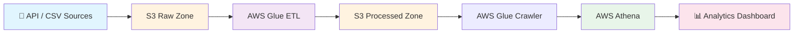
```

**Sequence diagram for ETL process:**

```markdown
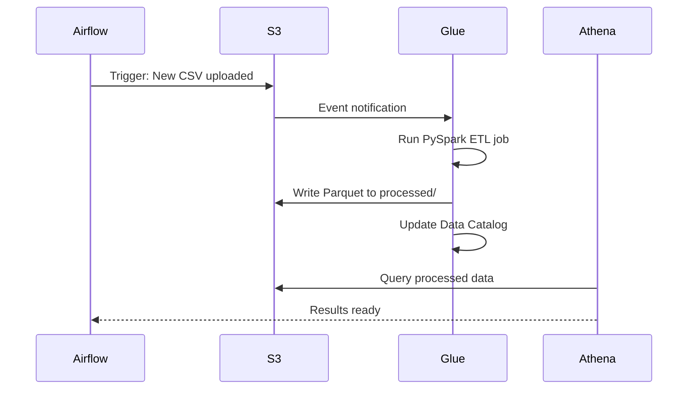
```

**Star schema diagram:**

```markdown
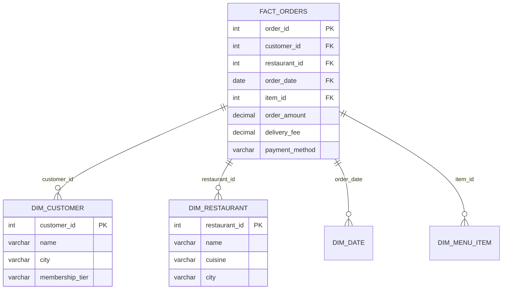
```

#### Option B: ASCII Art Diagrams (Always Works)

When Mermaid doesn't render (some markdown viewers), ASCII is your fallback:

```
┌─────────────────────────────────────────────────────────┐
│              MAKANEXPRESS DATA PLATFORM                  │
├─────────────────────────────────────────────────────────┤
│                                                          │
│  ┌──────────┐    ┌──────────┐    ┌──────────┐           │
│  │  Sources  │    │   S3     │    │ Compute  │           │
│  │          │    │  Data    │    │          │           │
│  │ • CSV    │───▶│  Lake    │───▶│ • Glue   │           │
│  │ • API    │    │          │    │ • PySpark│           │
│  │ • DB     │    │ raw/     │    │          │           │
│  └──────────┘    │ proc/    │    └────┬─────┘           │
│                  │ analytics│         │                  │
│                  └──────────┘         ▼                  │
│                              ┌──────────────┐           │
│                              │   Athena     │           │
│                              │   (SQL on    │           │
│                              │    S3 data)  │           │
│                              └──────┬───────┘           │
│                                     │                   │
│                                     ▼                   │
│                              ┌──────────────┐           │
│                              │  📊 Analytics │           │
│                              │  Dashboards   │           │
│                              └──────────────┘           │
└─────────────────────────────────────────────────────────┘
```

**Exercise 2:** Create architecture diagrams for all 5 repos. Use Mermaid for the primary (GitHub renders it), ASCII as fallback.

<details>
<summary>🔑 Example diagrams per repo</summary>

**1. retail-sales-analysis** (simple):
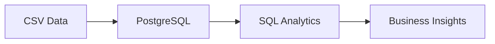

**2. crypto-data-pipeline** (ETL):
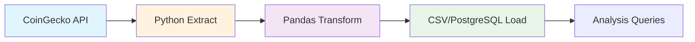

**3. food-delivery-dbt** (dbt pipeline):
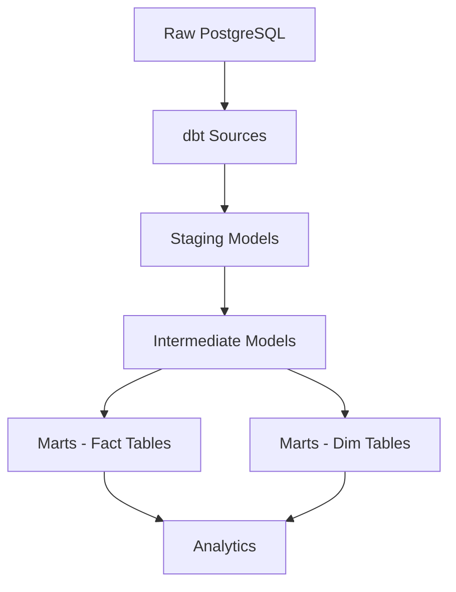

**4. food-delivery-warehouse** (full warehouse):
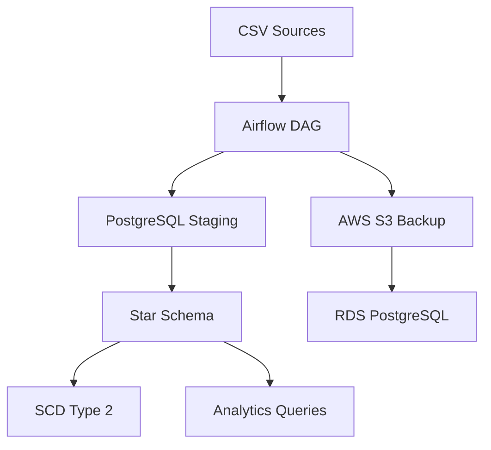

**5. makanexpress-serverless** (AWS serverless):
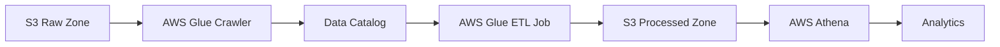

</details>

---

## 🌤️ Afternoon Block (2 hours): Screenshots, Sample Outputs, Commit Cleanup

### Part 3: Sample Query Outputs

Show employers what your queries return. Don't make them clone and run — show results inline.

**Format for sample outputs:**

```markdown
### Sample Query: Top 10 Restaurants by Revenue

```sql
SELECT 
    r.restaurant_name,
    r.cuisine_type,
    COUNT(*) AS total_orders,
    SUM(f.order_amount) AS total_revenue
FROM fact_orders f
JOIN dim_restaurant r ON f.restaurant_id = r.restaurant_id
WHERE f.order_date BETWEEN '2026-01-01' AND '2026-06-30'
GROUP BY r.restaurant_name, r.cuisine_type
ORDER BY total_revenue DESC
LIMIT 10;
```

**Output:**
```
 restaurant_name     | cuisine_type | total_orders | total_revenue
---------------------+--------------+--------------+---------------
 Tian Tian Hainanese | Chicken Rice |        4521  |     67815.00
 Song Fa Bak Kut Teh | Bak Kut Teh  |        3201  |     57618.00
 Jumbo Seafood       | Seafood      |        2890  |     86700.00
 Nasi Lemak Husin    | Malay        |        4102  |     49224.00
```
```

**Exercise 3:** Add 3-5 sample queries with outputs to each repo's README or a `sample-queries.md` file.

<details>
<summary>🔑 Tips for good sample outputs</summary>

1. **Pick impressive queries** — window functions, CTEs, complex joins, not simple SELECT *
2. **Show realistic data** — use Singapore/Malaysian restaurant names, cities, food items
3. **Include the question** — "Which restaurants have the highest repeat customer rate?"
4. **Show both query AND output** — recruiters need to see you can write SQL AND interpret results
5. **Add business context** — "This query helps MakanExpress identify which restaurants to feature in promotions"

Example for `crypto-data-pipeline`:
```markdown
### Sample Output: Top 5 Cryptocurrencies by 24h Volume
```
   name         | price_usd | market_cap    | volume_24h
----------------+-----------+---------------+------------
 Bitcoin        |  67432.50 | 1.32T         | 28.5B
 Ethereum       |   3521.80 | 423.1B        | 15.2B
 Solana         |    178.45 | 79.3B         |  4.1B
```
```

</details>

### Part 4: Screenshots (Optional but Powerful)

If you have any dashboards, Athena query results, or Airflow DAG graphs, screenshot them.

**How to add screenshots:**
1. Create an `images/` folder in each repo
2. Save screenshots as PNG (not JPG — text is clearer)
3. Reference in README:

```markdown

*Above: The MakanExpress Airflow DAG showing the full ETL pipeline*
```

**What to screenshot (if applicable):**
- Airflow DAG graph (tree view and graph view)
- Athena query results in AWS console
- dbt docs generated site
- Terminal output of pipeline running
- S3 bucket structure in AWS console

**Exercise 4:** Take screenshots for at least 3 repos and add them to READMEs.

<details>
<summary>🔑 Screenshot checklist</summary>

For each repo, these screenshots add value:

1. **retail-sales-analysis:** Terminal showing query results + schema diagram
2. **crypto-data-pipeline:** Terminal showing pipeline running (extract → transform → load)
3. **food-delivery-dbt:** dbt docs site (if generated) + test results
4. **food-delivery-warehouse:** Airflow DAG graph + sample query results
5. **makanexpress-serverless:** S3 bucket structure + Athena query results + Glue job run

Naming convention:
```
images/
├── airflow-dag-graph.png
├── athena-query-results.png
├── s3-bucket-structure.png
├── sample-dashboard.png
└── pipeline-terminal.png
```

</details>

### Part 5: Clean Up Commit Messages

**Bad commit history:**
```
fix stuff
update
wip
asdf
test
final
final v2
FINAL
please work
```

**Good commit history:**
```
feat: add star schema for food delivery warehouse
docs: add architecture diagram to README
fix: handle null values in customer dimension
test: add data quality checks for order amounts
refactor: extract common transformation macros
chore: update dependencies
```

**Conventional Commits format:**
```
type(scope): description

Types: feat, fix, docs, style, refactor, test, chore, perf
```

**Exercise 5:** Review your last 20 commits across all repos. If any are vague, note what you'd change.

<details>
<summary>🔑 Commit message best practices</summary>

You can't easily rewrite history (and shouldn't try for portfolio repos). Going forward, use conventional commits:

| Type | When | Example |
|------|------|---------|
| `feat` | New feature | `feat(warehouse): add SCD Type 2 for customer dimension` |
| `fix` | Bug fix | `fix(etl): handle duplicate order IDs in staging` |
| `docs` | Documentation | `docs(readme): add architecture diagram and badges` |
| `test` | Adding tests | `test(dbt): add uniqueness test for order_id` |
| `refactor` | Code cleanup | `refactor(sql): use CTE instead of subquery for readability` |
| `chore` | Maintenance | `chore(deps): update dbt to 1.7.4` |
| `perf` | Performance | `perf(query): add index on order_date for faster filtering` |

**Rule of thumb:** If someone reads only your commit messages, can they understand what happened?

</details>

### Part 6: .gitignore Check

Ensure every repo has a proper `.gitignore`. Common mistakes:

```gitignore
# Python
__pycache__/
*.pyc
.env
*.egg-info/
dist/
build/
venv/

# Data files (don't commit large CSVs)
*.csv
*.parquet
*.json
!sample_data/*.csv  # exception: small sample files are OK

# IDE
.vscode/
.idea/
.DS_Store

# AWS
.aws/credentials

# Airflow
airflow.db
airflow-webserver.pid
airflow.cfg

# dbt
dbt_packages/
logs/
target/
```

**Exercise 6:** Check `.gitignore` in all 5 repos. Are you accidentally tracking secrets, large files, or temp files?

<details>
<summary>🔑 Common .gitignore mistakes</summary>

**Dangerous files that should NEVER be committed:**
- `.env` — contains database passwords, API keys
- `.aws/credentials` — AWS access keys
- `airflow.cfg` — may contain connection strings with passwords
- Any file with hardcoded passwords

**Large files that slow down the repo:**
- CSV files > 1MB (use .gitignore + store in S3 or provide download link)
- Parquet files
- Database dumps
- Log files

**How to check:**
```bash
# Find files > 1MB in your repo
find . -type f -size +1M -not -path "./.git/*"

# Check if you've committed secrets
git log --all --full-history -- "*.env" ".aws/credentials"
```

If you find secrets in history, you need to:
1. Rotate those credentials immediately
2. Use `git filter-branch` or BFG Repo Cleaner to remove from history (advanced — may be easier to create a new repo)

</details>

---

## 🌙 Evening (1 hour): Final Consistency Check

### The 5-Repo Audit Checklist

Run through this for EVERY repo:

```markdown
## Repo Audit Checklist

### README.md
- [ ] Badges at the top (tech stack, status, license)
- [ ] One-paragraph project description
- [ ] Architecture diagram (Mermaid or ASCII)
- [ ] Tech stack listed
- [ ] Setup instructions (clone, install, run)
- [ ] Sample queries with outputs (3-5)
- [ ] Screenshots (if applicable)
- [ ] Link to related repos

### Code Quality
- [ ] No hardcoded credentials
- [ ] .gitignore is proper
- [ ] No large files committed
- [ ] Folder structure is logical
- [ ] Code has comments explaining WHY

### Git
- [ ] Commit messages are descriptive (going forward)
- [ ] No "fix stuff" or "asdf" commits
- [ ] Reasonable number of commits (shows consistent work)

### Portfolio Value
- [ ] Can a recruiter understand this in 30 seconds?
- [ ] Does it demonstrate real data engineering skills?
- [ ] Is the SG/MY context visible (shows local relevance)?
```

### Cross-Repo Linking

Add a "Related Projects" section to each README:

```markdown
## 🔗 Related Projects

This repo is part of my Data Engineering portfolio:

| Project | Focus | Tech |
|---------|-------|------|
| [Retail Sales Analysis](https://github.com/YOUR_USERNAME/retail-sales-analysis) | SQL Analytics | PostgreSQL, Window Functions |
| [Crypto Pipeline](https://github.com/YOUR_USERNAME/crypto-data-pipeline) | Python ETL | Python, Pandas, API |
| [Food Delivery dbt](https://github.com/YOUR_USERNAME/food-delivery-dbt) | dbt Analytics | dbt, SQL, Testing |
| [Food Delivery Warehouse](https://github.com/YOUR_USERNAME/food-delivery-warehouse) | Data Warehouse | Star Schema, Airflow, AWS |
| **[MakanExpress Serverless](https://github.com/YOUR_USERNAME/makanexpress-serverless)** | Serverless Pipeline | AWS Glue, Athena, PySpark |
```

### Push Everything

```bash
# For each repo
cd ~/projects/retail-sales-analysis
git add .
git commit -m "docs: add badges, architecture diagram, sample queries"
git push origin main

cd ~/projects/crypto-data-pipeline
git add .
git commit -m "docs: add shields.io badges and sample pipeline output"
git push origin main

# ... repeat for all 5
```

### 📝 Today's Checklist

- [ ] Added shields.io badges to all 5 repo READMEs
- [ ] Created Mermaid architecture diagrams for all repos
- [ ] Added 3-5 sample queries with outputs to each repo
- [ ] Screenshots added where applicable (Airflow DAG, Athena results, etc.)
- [ ] Reviewed commit messages — noted improvements for future
- [ ] Verified .gitignore is proper in all repos
- [ ] No secrets or large files committed
- [ ] Added cross-repo "Related Projects" section to all READMEs
- [ ] All changes pushed to GitHub
- [ ] All 5 repos look professional and consistent

---

## 📋 Quick Reference: shields.io Badge URLs

```
# Format
https://img.shields.io/badge/{LABEL}-{MESSAGE}-{COLOR}

# With logo
https://img.shields.io/badge/{LABEL}-{MESSAGE}-{COLOR}?logo={LOGO}&logoColor=white

# Social badges
https://img.shields.io/github/stars/{USER}/{REPO}?style=social
https://img.shields.io/github/last-commit/{USER}/{REPO}

# Common logos (simple-icons names)
python, postgresql, amazonaws, apachespark, docker, git, github

# Common colors
brightgreen, green, yellowgreen, yellow, orange, red, blue, lightgrey
```

## 📋 Quick Reference: Mermaid Diagram Types

```markdown
# Flowchart (most common for architecture)
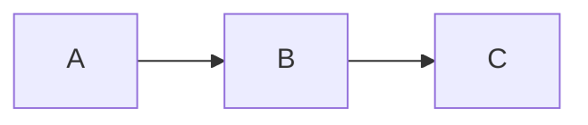

# Sequence Diagram (for process flows)
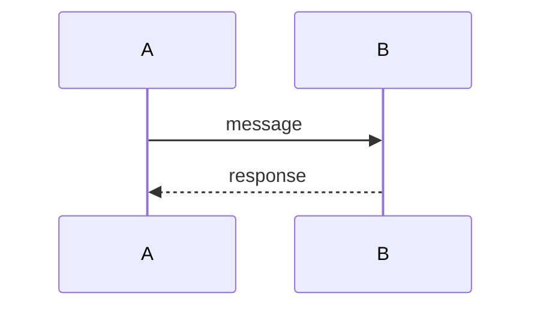

# ER Diagram (for schemas)
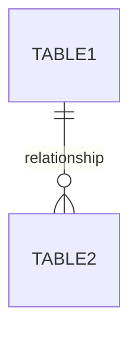
```

---

*Day 54 complete! Tomorrow: Mid-Program Assessment covering ALL 8 weeks.* 📝
